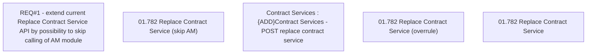

# CBL-6153 (CLM-2992) Extend maintenance function for bulk change of service on contracts

- **Diagram Type**: Custom
- **Package**: HomerSelect/BSL/Requirements Model/Finished/CLM/CBL-6153 (CLM-2992) Extend maintenance function for bulk change of service on contracts
- **Diagram ID**: 144811
- **Elements**: 6
- **Connectors**: 0

