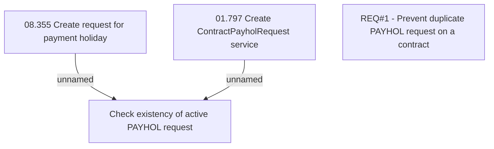

# CBL-6153 (CLM-3085) Prevent duplicate PAYHOL application on a contract

- **Diagram Type**: Custom
- **Package**: HomerSelect/BSL/Requirements Model/Finished/CLM/CBL-6153 (CLM-3085) Prevent duplicate PAYHOL application on a contract
- **Diagram ID**: 144800
- **Elements**: 4
- **Connectors**: 2

