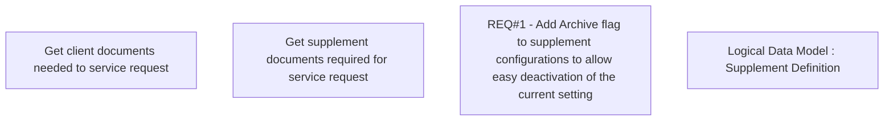

# CBL-6153 (CLM-3156) Improvement of Supplement configuration

- **Diagram Type**: Custom
- **Package**: HomerSelect/BSL/Requirements Model/Finished/CLM/CBL-6153 (CLM-3156) Improvement of Supplement configuration
- **Diagram ID**: 144808
- **Elements**: 4
- **Connectors**: 0

