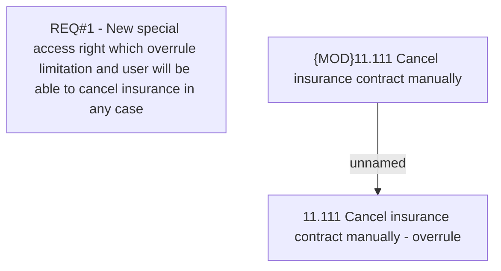

# CBL-6153 (CLM-3221) Insurance cancellation - implement overrule access right

```mermaid
graph TD
    REQ_1_New_special_access_right_which_overrule_limitation_and["REQ#1 - New special access right which overrule limitation and user will be able to cancel insurance in any case"]
    MOD_11_111_Cancel_insurance_contract_manually["{MOD}11.111 Cancel insurance contract manually"]
    n_11_111_Cancel_insurance_contract_manually_overrule["11.111 Cancel insurance contract manually - overrule"]
    MOD_11_111_Cancel_insurance_contract_manually -->|unnamed| n_11_111_Cancel_insurance_contract_manually_overrule
```
