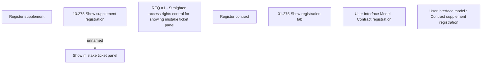

# CBL-6153 (CLM-3253) Ticket search access rights used for contract and supplement registration

- **Diagram Type**: Custom
- **Package**: HomerSelect/BSL/Requirements Model/Finished/CLM/CBL-6153 (CLM-3253) Ticket search access rights used for contract and supplement registration
- **Diagram ID**: 144822
- **Elements**: 8
- **Connectors**: 1

