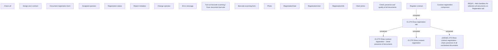

# CBL-6256 (CLM-2060) Select all documents for registration

```mermaid
graph TD
    Check_all["Check all"]
    Assign_next_contract["Assign next contract"]
    Document_registration_form["Document registration form"]
    Assigned_operator["Assigned operator"]
    Registration_status["Registration status"]
    Report_mistakes["Report mistakes"]
    Change_operator["Change operator"]
    Error_message["Error message"]
    Turn_on_barcode_scanning_Scan_document_barcode["Turn on barcode scanning / Scan document barcode"]
    Barcode_scanning_form["Barcode scanning form"]
    Photo["Photo"]
    RegistrationDate["RegistrationDate"]
    RegistrationUser["RegistrationUser"]
    RegistrationInfo["RegistrationInfo"]
    Client_photo["Client photo"]
    Check_presence_and_quality_of_all_documents["Check presence and quality of all documents"]
    Register_contract["Register contract"]
    Contract_registration_component["Contract registration component"]
    Register_contract["Register contract"]
    ADD_01_275_Show_contract_registration_check_presence_of_all_["{ADD}01.275 Show contract registration - check presence of all unchecked documents"]
    n_01_275_Show_contract_registration_check_presence_of_docume["01.275 Show contract registration - check presence of documents"]
    n_01_275_Show_registration_tab["01.275 Show registration tab"]
    n_01_275_Show_contract_registration["01.275 Show contract registration"]
    REQ_1_Add_checkbox_for_selection_all_documents_on_Registrati["REQ#1 - Add checkbox for selection all documents on Registration tab"]
    n_01_275_Show_registration_tab -->|unnamed| n_01_275_Show_contract_registration_check_presence_of_docume
    n_01_275_Show_registration_tab -->|unnamed| n_01_275_Show_contract_registration
    n_01_275_Show_registration_tab -->|unnamed| ADD_01_275_Show_contract_registration_check_presence_of_all_
    Register_contract -->|unnamed| n_01_275_Show_registration_tab
```
