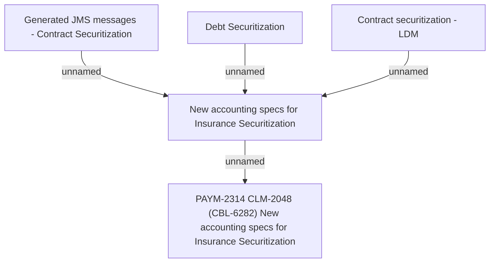

# PAYM-2314 CLM-2048 (CBL-6282) New accounting specs for Insurance Securitization

```mermaid
graph TD
    Generated_JMS_messages_Contract_Securitization["Generated JMS messages - Contract Securitization"]
    Debt_Securitization["Debt Securitization"]
    Contract_securitization_LDM["Contract securitization - LDM"]
    New_accounting_specs_for_Insurance_Securitization["New accounting specs for Insurance Securitization"]
    PAYM_2314_CLM_2048_CBL_6282_New_accounting_specs_for_Insuran["PAYM-2314 CLM-2048 (CBL-6282) New accounting specs for Insurance Securitization"]
    New_accounting_specs_for_Insurance_Securitization -->|unnamed| PAYM_2314_CLM_2048_CBL_6282_New_accounting_specs_for_Insuran
    Generated_JMS_messages_Contract_Securitization -->|unnamed| New_accounting_specs_for_Insurance_Securitization
    Debt_Securitization -->|unnamed| New_accounting_specs_for_Insurance_Securitization
    Contract_securitization_LDM -->|unnamed| New_accounting_specs_for_Insurance_Securitization
```
