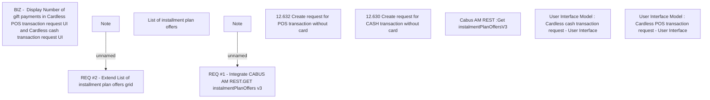

# CBL-6286 (CLM-2709) Gift Payment Service for REL Products (POS on Card)

- **Diagram Type**: Custom
- **Package**: HomerSelect/BSL/Requirements Model/Finished/CLM/CBL-6286 (CLM-2709) Gift Payment Service for REL Products (POS on Card)
- **Diagram ID**: 124986
- **Elements**: 11
- **Connectors**: 2

