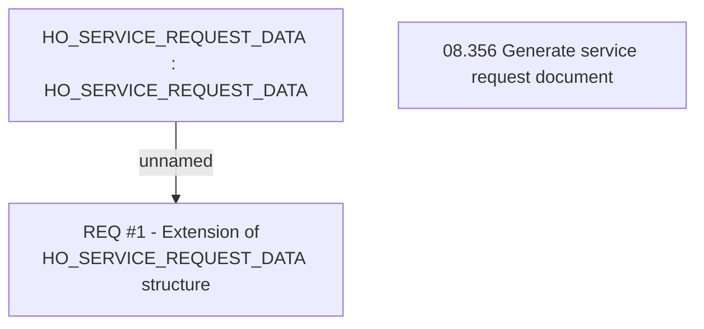

# CBL-6302 (CLM-2132) Modify data source HO_SERVICE_REQUEST_DATA

- **Diagram Type**: Custom
- **Package**: HomerSelect/BSL/Requirements Model/Finished/CLM/CBL-6302 (CLM-2132) Modify data source HO_SERVICE_REQUEST_DATA
- **Diagram ID**: 118029
- **Elements**: 3
- **Connectors**: 1

