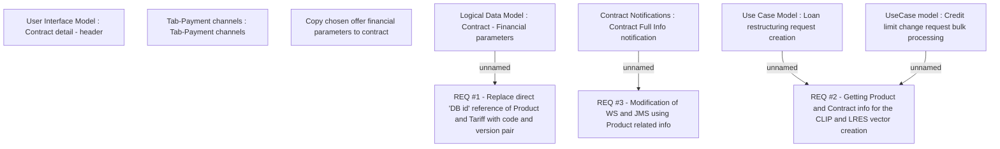

# CBL-6335 (CLM-2105) Insurance premium calculation and bundling of services

```mermaid
graph TD
    User_Interface_Model_Contract_detail_header["User Interface Model : Contract detail - header"]
    Tab_Payment_channels_Tab_Payment_channels["Tab-Payment channels : Tab-Payment channels"]
    Copy_chosen_offer_financial_parameters_to_contract["Copy chosen offer financial parameters to contract"]
    Logical_Data_Model_Contract_Financial_parameters["Logical Data Model : Contract - Financial parameters"]
    REQ_1_Replace_direct_DB_id_reference_of_Product_and_Tariff_w["REQ #1 - Replace direct 'DB id' reference of Product and Tariff with code and version pair"]
    Contract_Notifications_Contract_Full_Info_notification["Contract Notifications : Contract Full Info notification"]
    REQ_3_Modification_of_WS_and_JMS_using_Product_related_info["REQ #3 - Modification of WS and JMS using Product related info"]
    Use_Case_Model_Loan_restructuring_request_creation["Use Case Model : Loan restructuring request creation"]
    UseCase_model_Credit_limit_change_request_bulk_processing["UseCase model : Credit limit change request bulk processing"]
    REQ_2_Getting_Product_Contract_info_for_the_CLIP_LRES_vector["REQ #2 - Getting Product and Contract info for the CLIP and LRES vector creation"]
    Use_Case_Model_Loan_restructuring_request_creation -->|unnamed| REQ_2_Getting_Product_Contract_info_for_the_CLIP_LRES_vector
    UseCase_model_Credit_limit_change_request_bulk_processing -->|unnamed| REQ_2_Getting_Product_Contract_info_for_the_CLIP_LRES_vector
    Contract_Notifications_Contract_Full_Info_notification -->|unnamed| REQ_3_Modification_of_WS_and_JMS_using_Product_related_info
    Logical_Data_Model_Contract_Financial_parameters -->|unnamed| REQ_1_Replace_direct_DB_id_reference_of_Product_and_Tariff_w
```
