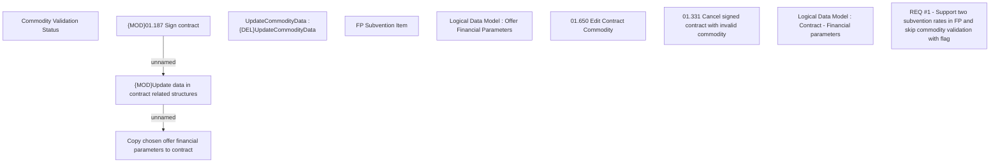

# CBL-6340 (CLM-3148) Support two subvention rates in Financial Parameters and skip commodity validation with flag

- **Diagram Type**: Custom
- **Package**: HomerSelect/BSL/Requirements Model/Finished/CLM/CBL-6340 (CLM-2208) Enhancements in homer system to accommodate two subvention rates/CBL-6340 (CLM-3148) Support two subvention rates in Financial Parameters and skip commodity validation with flag
- **Diagram ID**: 144806
- **Elements**: 11
- **Connectors**: 2

