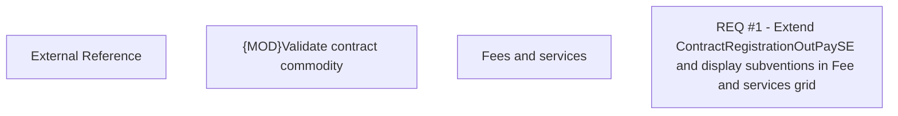

# CBL-6340 (CLM-3149) Extend ContractRegistrationOutPaySE and display subventions in Fee and services grid

- **Diagram Type**: Custom
- **Package**: HomerSelect/BSL/Requirements Model/Finished/CLM/CBL-6340 (CLM-2208) Enhancements in homer system to accommodate two subvention rates/CBL-6340 (CLM-3149) Extend ContractRegistrationOutPaySE and display subventions in Fee and services grid
- **Diagram ID**: 144812
- **Elements**: 4
- **Connectors**: 0

