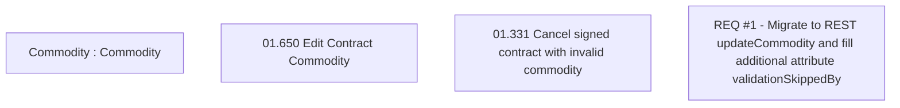

# CBL-6340 (CLM-3322) Migrate to REST updateCommodity and fill additional attribute skipped_by

- **Diagram Type**: Custom
- **Package**: HomerSelect/BSL/Requirements Model/Finished/CLM/CBL-6340 (CLM-2208) Enhancements in homer system to accommodate two subvention rates/CBL-6340 (CLM-3322) Migrate to REST updateCommodity and fill additional attribute skipped_by
- **Diagram ID**: 144821
- **Elements**: 4
- **Connectors**: 0

