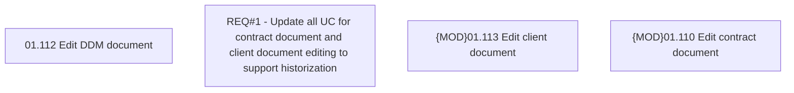

# CBL-6367 (CLM-2082) Document data historization

```mermaid
graph TD
    n_01_112_Edit_DDM_document["01.112 Edit DDM document"]
    REQ_1_Update_all_UC_for_contract_document_and_client_documen["REQ#1 - Update all UC for contract document and client document editing to support historization"]
    MOD_01_113_Edit_client_document["{MOD}01.113 Edit client document"]
    MOD_01_110_Edit_contract_document["{MOD}01.110 Edit contract document"]
```
