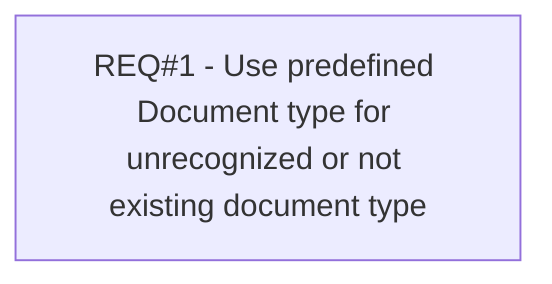

# CBL-6373 (CLM-2071) Upload of rejected documents to new document type

```mermaid
graph TD
    REQ_1_Use_predefined_Document_type_for_unrecognized_or_not_e["REQ#1 - Use predefined Document type for unrecognized or not existing document type"]
```
