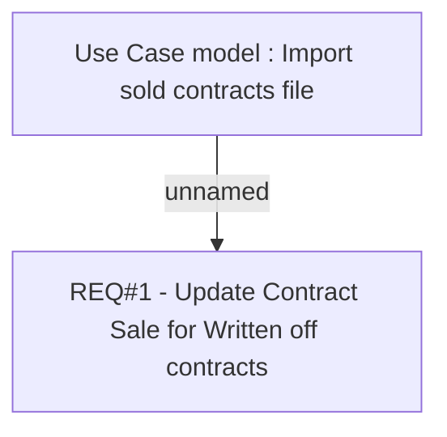

# CBL-6441 (CLM-2075) Import Sold Contracts - Update for Written off contracts

- **Diagram Type**: Custom
- **Package**: HomerSelect/BSL/Requirements Model/Finished/CLM/CBL-6441 (CLM-2075) Import Sold Contracts - Update for Written off contracts
- **Diagram ID**: 117017
- **Elements**: 2
- **Connectors**: 1

