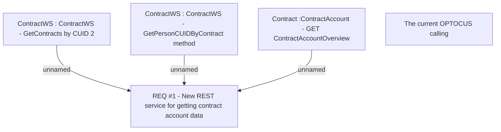

# CBL-6448 (CLM-2058) New Web Service for Contract Validation in OCTOPUS

- **Diagram Type**: Custom
- **Package**: HomerSelect/BSL/Requirements Model/Finished/CLM/CBL-6448 (CLM-2058) New Web Service for Contract Validation in OCTOPUS
- **Diagram ID**: 119737
- **Elements**: 5
- **Connectors**: 3

