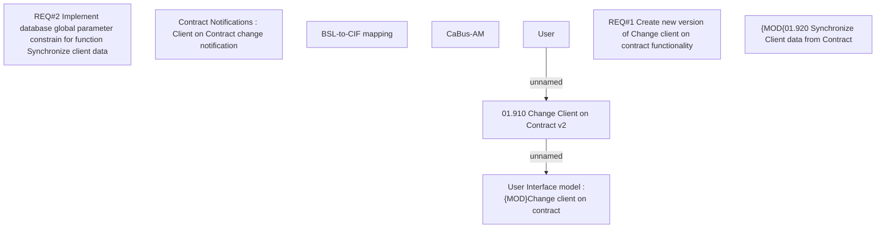

# CBL-6545 (CLM-2086) New maintenance function for Change client on contract

```mermaid
graph TD
    REQ_2_Implement_database_global_parameter_constrain_for_func["REQ#2 Implement database global parameter constrain for function Synchronize client data"]
    n_01_910_Change_Client_on_Contract_v2["01.910 Change Client on Contract v2"]
    Contract_Notifications_Client_on_Contract_change_notificatio["Contract Notifications : Client on Contract change notification"]
    BSL_to_CIF_mapping["BSL-to-CIF mapping"]
    CaBus_AM["CaBus-AM"]
    User_Interface_model_MOD_Change_client_on_contract["User Interface model :{MOD}Change client on contract"]
    User["User"]
    REQ_1_Create_new_version_of_Change_client_on_contract_functi["REQ#1 Create new version of Change client on contract functionality"]
    MOD_01_920_Synchronize_Client_data_from_Contract["{MOD{01.920 Synchronize Client data from Contract"]
    User -->|unnamed| n_01_910_Change_Client_on_Contract_v2
    n_01_910_Change_Client_on_Contract_v2 -->|unnamed| User_Interface_model_MOD_Change_client_on_contract
```
