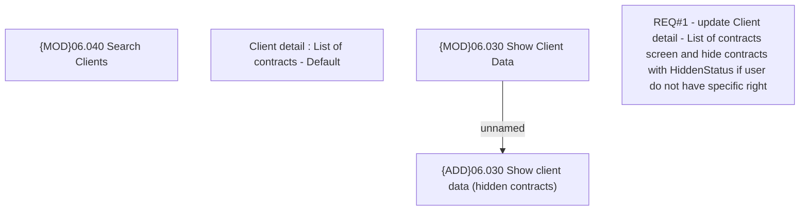

# CBL-6566 (CLM-2222) Mystery Shopper search restriction for unauthorized user

- **Diagram Type**: Custom
- **Package**: HomerSelect/BSL/Requirements Model/Finished/CLM/CBL-6566 (CLM-2222) Mystery Shopper search restriction for unauthorized user
- **Diagram ID**: 119610
- **Elements**: 5
- **Connectors**: 1

