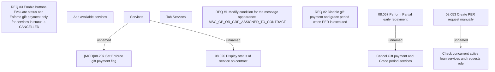

# CBL-6572 (CLM-2126) Disable gift payment and grace period when PER is executed

```mermaid
graph TD
    REQ_3_Enable_buttons_Evaluate_status_and_Enforce_gift_paymen["REQ #3 Enable buttons Evaluate status and Enforce gift payment only for services in status ‹› CANCELLED"]
    MOD_08_207_Set_Enforce_gift_payment_flag["{MOD}08.207 Set Enforce gift payment flag"]
    n_08_020_Display_status_of_service_on_contract["08.020 Display status of service on contract"]
    Add_available_services["Add available services"]
    Services["Services"]
    Tab_Services["Tab Services"]
    REQ_1_Modify_condition_for_the_message_appearance_MSG_GP_OR_["REQ #1 Modify condition for the message appearance MSG_GP_OR_GRP_ASSIGNED_TO_CONTRACT "]
    REQ_2_Disable_gift_payment_and_grace_period_when_PER_is_exec["REQ #2 Disable gift payment and grace period when PER is executed"]
    n_08_057_Perform_Partial_early_repayment["08.057 Perform Partial early repayment"]
    n_08_053_Create_PER_request_manually["08.053 Create PER request manually"]
    Cancel_Gift_payment_and_Grace_period_services["Cancel Gift payment and Grace period services"]
    Check_concurrent_active_loan_services_and_requests_rule["Check concurrent active loan services and requests rule"]
    Services -->|unnamed| MOD_08_207_Set_Enforce_gift_payment_flag
    Services -->|unnamed| n_08_020_Display_status_of_service_on_contract
    n_08_053_Create_PER_request_manually -->|unnamed| Check_concurrent_active_loan_services_and_requests_rule
    n_08_057_Perform_Partial_early_repayment -->|unnamed| Cancel_Gift_payment_and_Grace_period_services
```
