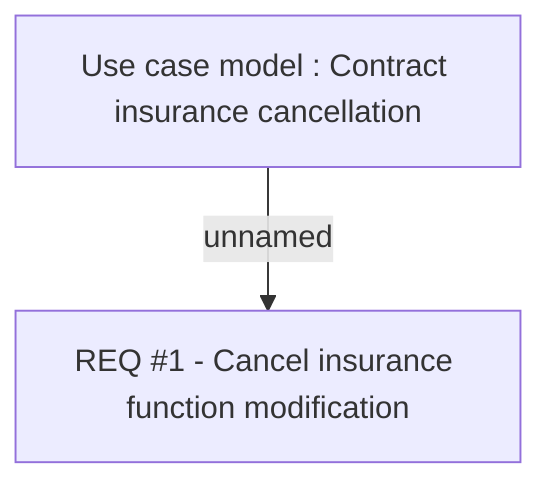

# CBL-6857 (CLM-2177) Cancel Insurance modification function

```mermaid
graph TD
    Use_case_model_Contract_insurance_cancellation["Use case model : Contract insurance cancellation"]
    REQ_1_Cancel_insurance_function_modification["REQ #1 - Cancel insurance function modification"]
    Use_case_model_Contract_insurance_cancellation -->|unnamed| REQ_1_Cancel_insurance_function_modification
```
