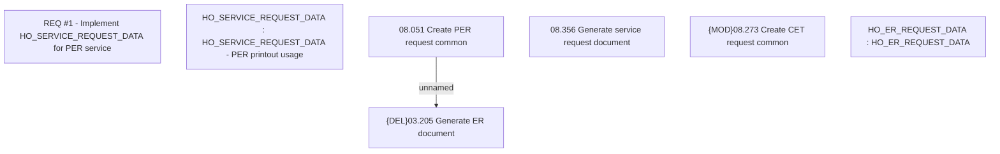

# CBL-6984 (CLM-2206) Implement HO_SERVICE_REQUEST_DATA for PER service

- **Diagram Type**: Custom
- **Package**: HomerSelect/BSL/Requirements Model/Finished/CLM/CBL-6984 (CLM-2206) Implement HO_SERVICE_REQUEST_DATA for PER service
- **Diagram ID**: 121148
- **Elements**: 7
- **Connectors**: 1

