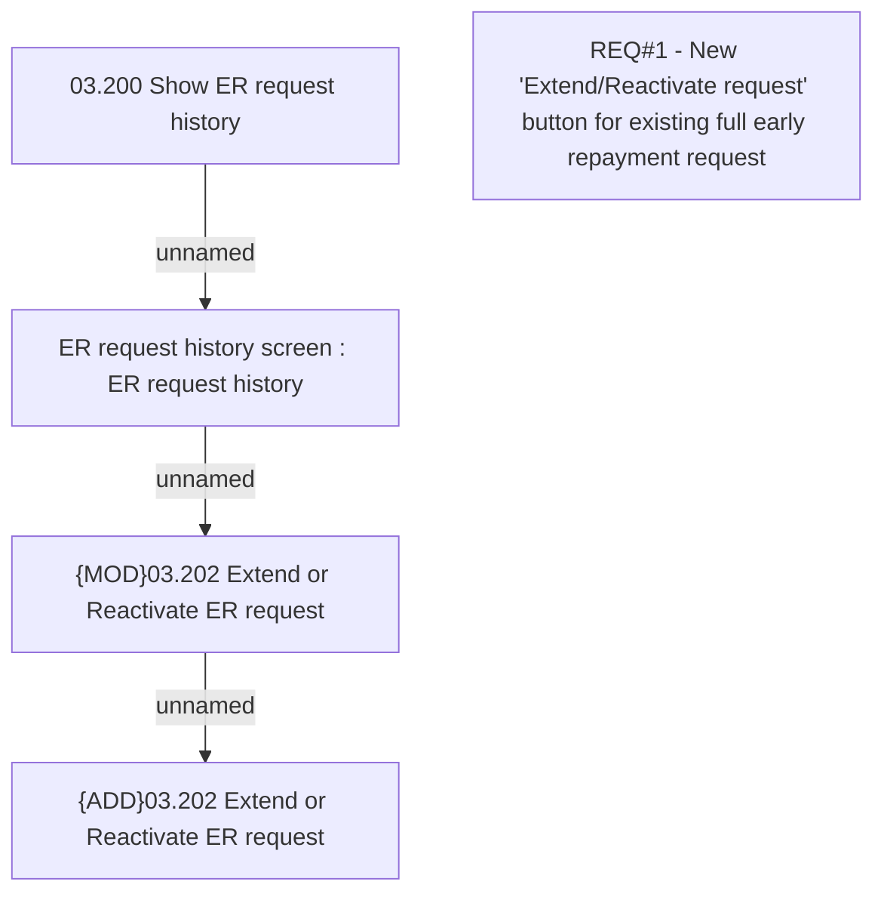

# CBL-7022 (CLM-2201) Admin function for FER request in the past

- **Diagram Type**: Custom
- **Package**: HomerSelect/BSL/Requirements Model/Finished/CLM/CBL-7022 (CLM-2201) Admin function for FER request in the past
- **Diagram ID**: 119402
- **Elements**: 5
- **Connectors**: 3

