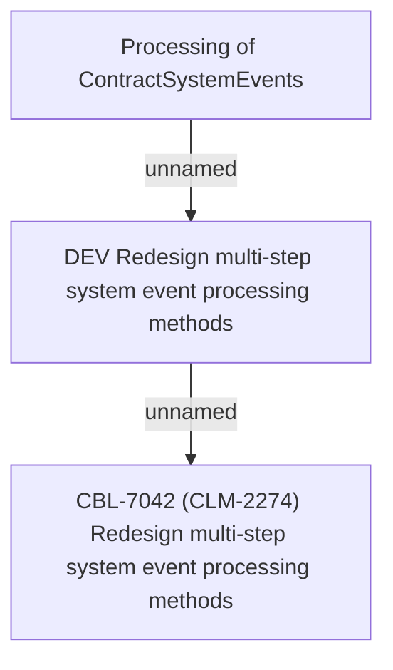

# CBL-7042 (CLM-2274) Redesign multi-step system event processing methods

- **Diagram Type**: Custom
- **Package**: HomerSelect/BSL/Requirements Model/Finished/CLM/CBL-7042 (CLM-2274) Redesign multi-step system event processing methods
- **Diagram ID**: 119403
- **Elements**: 3
- **Connectors**: 2

