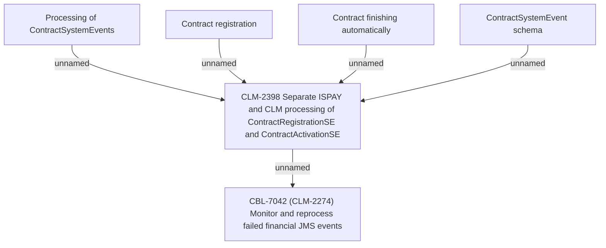

# CBL-7042 (CLM-2398) Separate ISPAY and CLM processing of ContractRegistrationSE and ContractActivationSE

- **Diagram Type**: Custom
- **Package**: HomerSelect/BSL/Requirements Model/Finished/CLM/CBL-7042 (CLM-2398) Separate ISPAY and CLM processing of ContractRegistrationSE and ContractActivationSE
- **Diagram ID**: 119741
- **Elements**: 6
- **Connectors**: 5

