# CBL-7136 (CLM-2381) Redesign Client detail - Marketing Offer tab

- **Diagram Type**: Custom
- **Package**: HomerSelect/BSL/Requirements Model/Finished/CLM/CBL-7136 (CLM-2381) Redesign Client detail - Marketing Offer tab
- **Diagram ID**: 120832
- **Elements**: 8
- **Connectors**: 6

```mermaid
graph TD
    UseCase_Model_Client_management["UseCase Model : Client management"]
    Offer_Store_Offer_Store_API_Offer_Controller_Management_of_c["Offer Store : Offer Store API - Offer Controller (Management of customer offers)"]
    Customer_offers_tab_v2_Customer_offers_tab_v2["Customer offers tab v2 : Customer offers tab v2"]
    Client_detail_Client_detail["Client detail : Client detail"]
    REQ_1_Redesign_Customer_offer_tab_on_the_Client_detail["REQ #1 - Redesign Customer offer tab on the Client detail"]
    Client_detail_Client_detail_Tab_Marketing_Offers["Client detail : Client detail - Tab Marketing Offers"]
    User_Interface_Marketing_offers_management_SAS["User Interface : Marketing offers management (SAS)"]
    User_Interface_Product_Marketing_Offers["User Interface : Product Marketing Offers"]
    UseCase_Model_Client_management -->|unnamed| REQ_1_Redesign_Customer_offer_tab_on_the_Client_detail
    Customer_offers_tab_v2_Customer_offers_tab_v2 -->|unnamed| REQ_1_Redesign_Customer_offer_tab_on_the_Client_detail
    Client_detail_Client_detail -->|unnamed| REQ_1_Redesign_Customer_offer_tab_on_the_Client_detail
    Client_detail_Client_detail_Tab_Marketing_Offers -->|unnamed| REQ_1_Redesign_Customer_offer_tab_on_the_Client_detail
    User_Interface_Marketing_offers_management_SAS -->|unnamed| REQ_1_Redesign_Customer_offer_tab_on_the_Client_detail
    User_Interface_Product_Marketing_Offers -->|unnamed| REQ_1_Redesign_Customer_offer_tab_on_the_Client_detail
```

