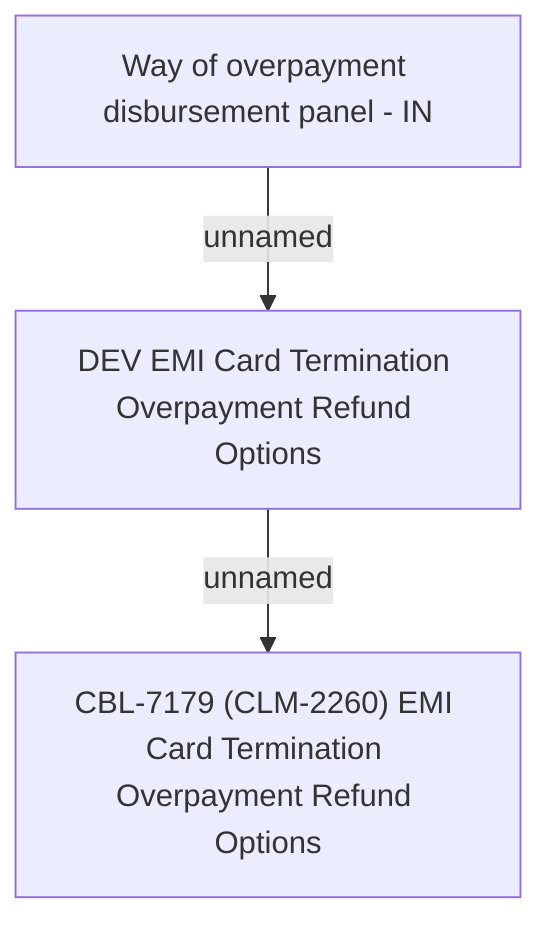

# CBL-7179 (CLM-2260) EMI Card Termination Overpayment Refund Options

- **Diagram Type**: Custom
- **Package**: HomerSelect/BSL/Requirements Model/Finished/CLM/CBL-7179 (CLM-2260) EMI Card Termination Overpayment Refund Options
- **Diagram ID**: 119367
- **Elements**: 3
- **Connectors**: 2

