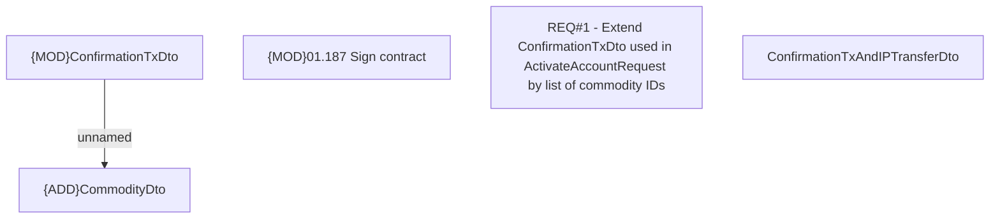

# CBL-7202 (CLM-2614) Subvention scheme for ICD/IPD transaction

```mermaid
graph TD
    ADD_CommodityDto["{ADD}CommodityDto"]
    MOD_ConfirmationTxDto["{MOD}ConfirmationTxDto"]
    MOD_01_187_Sign_contract["{MOD}01.187 Sign contract"]
    REQ_1_Extend_ConfirmationTxDto_used_in_ActivateAccountReques["REQ#1 - Extend ConfirmationTxDto used in ActivateAccountRequest by list of commodity IDs"]
    ConfirmationTxAndIPTransferDto["ConfirmationTxAndIPTransferDto"]
    MOD_ConfirmationTxDto -->|unnamed| ADD_CommodityDto
```
