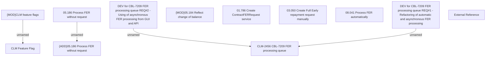

# CBL-7209 (CLM-2456) FER processing queue

```mermaid
graph TD
    MOD_CLM_feature_flags["{MOD}CLM feature flags"]
    CLM_Feature_Flag["CLM Feature Flag"]
    ADD_05_186_Process_FER_without_request["{ADD}05.186 Process FER without request"]
    n_05_186_Process_FER_without_request["05.186 Process FER without request"]
    DEV_for_CBL_7209_FER_processing_queue_REQ_2_Using_of_asynchr["DEV for CBL-7209 FER processing queue REQ#2 - Using of asynchronous FER processing from GUI and API"]
    MOD_05_184_Reflect_change_of_balance["{MOD}05.184 Reflect change of balance"]
    n_01_786_Create_ContractFERRequest_service["01.786 Create ContractFERRequest service"]
    n_03_050_Create_Full_Early_repayment_request_manually["03.050 Create Full Early repayment request manually"]
    n_08_041_Process_FER_automatically["08.041 Process FER automatically"]
    DEV_for_CBL_7209_FER_processing_queue_REQ_1_Refactoring_of_a["DEV for CBL-7209 FER processing queue REQ#1 - Refactoring of automatic and asynchronous FER processing"]
    CLM_2456_CBL_7209_FER_processing_queue["CLM-2456 CBL-7209 FER processing queue"]
    External_Reference["External Reference"]
    External_Reference["External Reference"]
    DEV_for_CBL_7209_FER_processing_queue_REQ_2_Using_of_asynchr -->|unnamed| CLM_2456_CBL_7209_FER_processing_queue
    DEV_for_CBL_7209_FER_processing_queue_REQ_1_Refactoring_of_a -->|unnamed| CLM_2456_CBL_7209_FER_processing_queue
    MOD_CLM_feature_flags -->|unnamed| CLM_Feature_Flag
    n_05_186_Process_FER_without_request -->|unnamed| ADD_05_186_Process_FER_without_request
```
