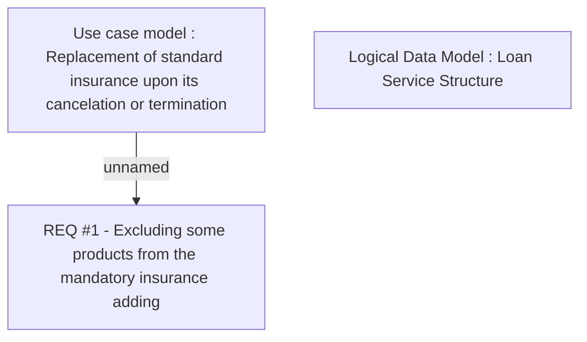

# CBL-7219 (CLM-2374) Exclude Mandatory Insurance on Two Wheelers Contract

- **Diagram Type**: Custom
- **Package**: HomerSelect/BSL/Requirements Model/Finished/CLM/CBL-7219 (CLM-2374) Exclude Mandatory Insurance on Two Wheelers Contract
- **Diagram ID**: 119995
- **Elements**: 3
- **Connectors**: 1

