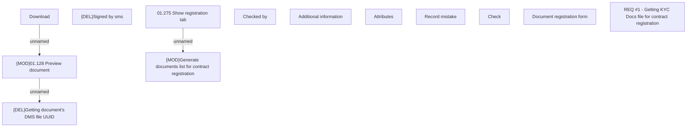

# CBL-7299 (CLM-2396) RBI Regulation for KYC Docs -To view KYC Docs on every contract

```mermaid
graph TD
    MOD_01_128_Preview_document["{MOD}01.128 Preview document"]
    n_01_275_Show_registration_tab["01.275 Show registration tab"]
    DEL_Signed_by_sms["{DEL}Signed by sms"]
    Download["Download"]
    Checked_by["Checked by"]
    Additional_information["Additional information"]
    Attributes["Attributes"]
    Record_mistake["Record mistake"]
    Check["Check"]
    Document_registration_form["Document registration form"]
    MOD_Generate_documents_list_for_contract_registration["{MOD}Generate documents list for contract registration"]
    REQ_1_Getting_KYC_Docs_file_for_contract_registration["REQ #1 - Getting KYC Docs file for contract registration"]
    DEL_Getting_document_s_DMS_file_UUID["{DEL}Getting document's DMS file UUID"]
    Download -->|unnamed| MOD_01_128_Preview_document
    n_01_275_Show_registration_tab -->|unnamed| MOD_Generate_documents_list_for_contract_registration
    MOD_01_128_Preview_document -->|unnamed| DEL_Getting_document_s_DMS_file_UUID
```
