# CBL-7307 (CLM-2276) Blocking disbursement on signed contracts before finishing

- **Diagram Type**: Custom
- **Package**: HomerSelect/BSL/Requirements Model/Finished/CLM/CBL-7307 (CLM-2276) Blocking disbursement on signed contracts before finishing
- **Diagram ID**: 148402
- **Elements**: 14
- **Connectors**: 1

```mermaid
graph TD
    External_Reference["External Reference"]
    MOD_01_714_Process_contract_registering_and_finishing["{MOD}01.714 Process contract registering and finishing"]
    DEL_01_252_Evaluate_Contract_Service_Parameters["{DEL}01.252 Evaluate Contract Service Parameters"]
    MOD_01_715_Finish_contract_automatically["{MOD}01.715 Finish contract automatically"]
    MOD_01_279_Choose_contracts_suitable_to_registration_and_fin["{MOD}01.279 Choose contracts suitable to registration and finishing"]
    DEL_01_712_Finish_contract_on_service_execution["{DEL}01.712 Finish contract on service execution"]
    Time["Time"]
    REQ_2_Modify_processing_of_CET_FER_request_and_use_LoanServi["REQ#2 - Modify processing of CET + FER request and use LoanServiceRequestExecutedSE and UC 01.172 for automatic finishing after processing"]
    REQ_1_Create_a_new_usecase_to_process_registration_and_finis["REQ#1 - Create a new usecase to process registration and finishing of contract"]
    ADD_01_714_Process_contract_registering_and_finishing["{ADD}01.714 Process contract registering and finishing"]
    MOD_05_094_Block_payments_for_a_contract["{MOD}05.094 Block payments for a contract"]
    MOD_08_252_Process_cooling_off_period["{MOD}08.252 Process cooling-off period"]
    MOD_08_280_Check_and_process_CET_request["{MOD}08.280 Check and process CET request"]
    n_03_100_Check_and_process_Early_repayment_request["03.100 Check and process Early repayment request"]
    Time -->|unnamed| MOD_08_252_Process_cooling_off_period
```

