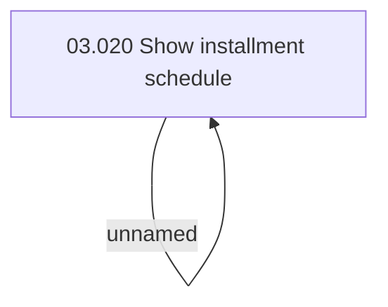

# CBL-7390 (CLM-2279) Presidency act - hide corrupted contract in BSL

- **Diagram Type**: Custom
- **Package**: HomerSelect/BSL/Requirements Model/Finished/CLM/CBL-7390 (CLM-2279) Presidency act - hide corrupted contract in BSL
- **Diagram ID**: 127644
- **Elements**: 2
- **Connectors**: 1

