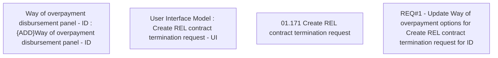

# CBL-7561 (CLM-2325) Hide Transfer to technical account option

```mermaid
graph TD
    Way_of_overpayment_disbursement_panel_ID_ADD_Way_of_overpaym["Way of overpayment disbursement panel - ID : {ADD}Way of overpayment disbursement panel - ID"]
    User_Interface_Model_Create_REL_contract_termination_request["User Interface Model : Create REL contract termination request - UI"]
    n_01_171_Create_REL_contract_termination_request["01.171 Create REL contract termination request"]
    REQ_1_Update_Way_of_overpayment_options_for_Create_REL_contr["REQ#1 - Update Way of overpayment options for Create REL contract termination request for ID"]
```
