# CBL-7585 (CLM-2727) Use REST API in communication with CIF

- **Diagram Type**: Custom
- **Package**: HomerSelect/BSL/Requirements Model/Finished/CLM/CBL-7585 (CLM-2727) Use REST API in communication with CIF
- **Diagram ID**: 127725
- **Elements**: 10
- **Connectors**: 9

```mermaid
graph TD
    Technical_Technical_Global_Parameter["Technical : Technical Global Parameter"]
    CBL_7585_CLM_2727_Use_REST_API_in_communication_with_CIF_Ove["CBL-7585 (CLM-2727) Use REST API in communication with CIF : Overview"]
    CBL_7585_CLM_2727_Use_REST_API_in_communication_with_CIF_CLM["CBL-7585 (CLM-2727) Use REST API in communication with CIF : CLM Overview"]
    v1_CustomerPerson_Person["v1 : CustomerPerson - Person"]
    v1_CustomerPerson["v1 : CustomerPerson"]
    v1_Customer_Data_Responses["v1 : Customer Data - Responses"]
    REQ_2_Feature_flag_and_switches["REQ#2 - Feature flag and switches"]
    REQ_1_Mappings["REQ#1 Mappings"]
    v1_1_Customer_Data_Requests["v1.1 :Customer Data - Requests"]
    CLM_2438_CBL_7585_Use_REST_API_in_communication_with_CIF["CLM-2438 CBL-7585 Use REST API in communication with CIF"]
    REQ_2_Feature_flag_and_switches -->|unnamed| CBL_7585_CLM_2727_Use_REST_API_in_communication_with_CIF_Ove
    REQ_2_Feature_flag_and_switches -->|unnamed| CLM_2438_CBL_7585_Use_REST_API_in_communication_with_CIF
    REQ_1_Mappings -->|unnamed| CLM_2438_CBL_7585_Use_REST_API_in_communication_with_CIF
    REQ_1_Mappings -->|unnamed| v1_1_Customer_Data_Requests
    REQ_1_Mappings -->|unnamed| v1_Customer_Data_Responses
    REQ_1_Mappings -->|unnamed| v1_CustomerPerson
    REQ_1_Mappings -->|unnamed| v1_CustomerPerson_Person
    REQ_2_Feature_flag_and_switches -->|unnamed| CBL_7585_CLM_2727_Use_REST_API_in_communication_with_CIF_CLM
    REQ_2_Feature_flag_and_switches -->|unnamed| Technical_Technical_Global_Parameter
```

