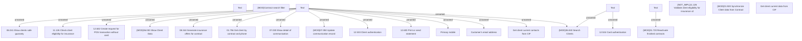

# CLM Overview

```mermaid
graph TD
    el_1520190["Text"]
    Get_client_current_contacts_from_CIF["Get client current contacts from CIF"]
    Customer_s_email_address["Customer's email address"]
    Primary_mobile["Primary mobile"]
    MOD_Contract_search_filter["{MOD}Contract search filter"]
    el_1520188["Text"]
    el_1520182["Text"]
    el_1520180["Text"]
    n_12_603_Print_or_send_statement["12.603 Print or send statement"]
    n_12_534_Card_authentication["12.534 Card authentication"]
    n_12_533_Client_authentication["12.533 Client authentication"]
    MOD_07_050_Update_communication_record["{MOD}07.050 Update communication record"]
    n_07_030_Show_detail_of_communication["07.030 Show detail of communication"]
    n_06_041_Show_clients_safe_guaranty["06.041 Show clients safe guaranty"]
    n_01_756_Get_client_by_contract_and_phone["01.756 Get client by contract and phone"]
    MOD_06_040_Search_Clients["{MOD}06.040 Search Clients"]
    MOD_06_030_Show_Client_Data["{MOD}06.030 Show Client Data"]
    n_12_632_Create_request_for_POS_transaction_without_card["12.632 Create request for POS transaction without card"]
    MOD_01_720_Reactivate_finished_contracts["{MOD}01.720 Reactivate finished contracts"]
    n_11_126_Check_client_eligibility_for_insurance["11.126 Check client eligibility for insurance"]
    n_08_344_Generate_insurance_offers_for_contract["08.344 Generate insurance offers for contract"]
    NOT_IMPL_11_126_Validate_client_eligibility_for_insurance_v2["{NOT_IMPL}11.126 Validate client eligibility for insurance v2"]
    MOD_01_920_Synchronize_Client_data_from_Contract["{MOD{01.920 Synchronize Client data from Contract"]
    Get_client_current_data_from_CIF["Get client current data from CIF"]
    el_1520188 -->|unnamed| MOD_06_040_Search_Clients
    el_1520188 -->|unnamed| Get_client_current_contacts_from_CIF
    el_1520188 -->|unnamed| Customer_s_email_address
    el_1520188 -->|unnamed| Primary_mobile
    el_1520188 -->|unnamed| n_12_603_Print_or_send_statement
    el_1520182 -->|unnamed| n_12_534_Card_authentication
    el_1520188 -->|unnamed| n_12_533_Client_authentication
    el_1520188 -->|unnamed| MOD_07_050_Update_communication_record
    el_1520188 -->|unnamed| n_07_030_Show_detail_of_communication
    el_1520188 -->|unnamed| n_01_756_Get_client_by_contract_and_phone
    el_1520188 -->|unnamed| n_08_344_Generate_insurance_offers_for_contract
    el_1520182 -->|unnamed| MOD_06_040_Search_Clients
    el_1520188 -->|unnamed| MOD_06_030_Show_Client_Data
    el_1520188 -->|unnamed| n_12_632_Create_request_for_POS_transaction_without_card
    el_1520180 -->|unnamed| MOD_01_720_Reactivate_finished_contracts
    el_1520188 -->|unnamed| n_11_126_Check_client_eligibility_for_insurance
    el_1520188 -->|unnamed| n_06_041_Show_clients_safe_guaranty
```
