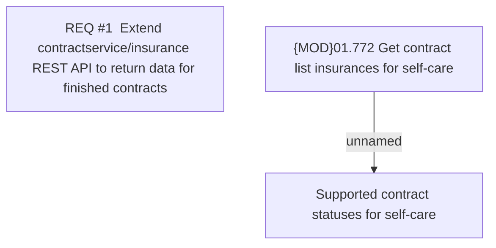

# CBL-7686 (CLM-2459) Enhancement Insurance API for Mobile Apps

```mermaid
graph TD
    Supported_contract_statuses_for_self_care["Supported contract statuses for self-care"]
    REQ_1_Extend_contractservice_insurance_REST_API_to_return_da["REQ #1  Extend contractservice/insurance REST API to return data for finished contracts"]
    MOD_01_772_Get_contract_list_insurances_for_self_care["{MOD}01.772 Get contract list insurances for self-care"]
    MOD_01_772_Get_contract_list_insurances_for_self_care -->|unnamed| Supported_contract_statuses_for_self_care
```
