# CBL-7747 (CLM-2734) Enhancement JMS ContractInsuranceService

- **Diagram Type**: Custom
- **Package**: HomerSelect/BSL/Requirements Model/Finished/CLM/CBL-7747 (CLM-2734) Enhancement JMS ContractInsuranceService
- **Diagram ID**: 125816
- **Elements**: 11
- **Connectors**: 0

```mermaid
graph TD
    MOD_01_715_Finish_contract_automatically["{MOD}01.715 Finish contract automatically"]
    n_01_730_Finish_contract_manually["01.730 Finish contract manually"]
    n_11_130_Terminate_finished_insurance_contracts["11.130 Terminate finished insurance contracts"]
    n_08_111_Cancel_contract_insurance_common["08.111 Cancel contract insurance common"]
    el_1503148["Note"]
    n_01_360_Cancel_contract["01.360 Cancel contract"]
    Use_case_model_Termination_of_Insurance_contract_options["Use case model : Termination of Insurance contract options"]
    Use_case_model_Contract_insurance_termination["Use case model : Contract insurance termination"]
    Use_case_model_Cancellation_of_Insurance_contract_options["Use case model : Cancellation of Insurance contract options"]
    REQ_2_Insurance_termination_notification_for_various_ways["REQ#2 - Insurance termination notification for various ways"]
    REQ_1_Insurance_cancellation_notification_when_loan_contract["REQ#1 - Insurance cancellation notification when loan contract is cancelled"]
```

