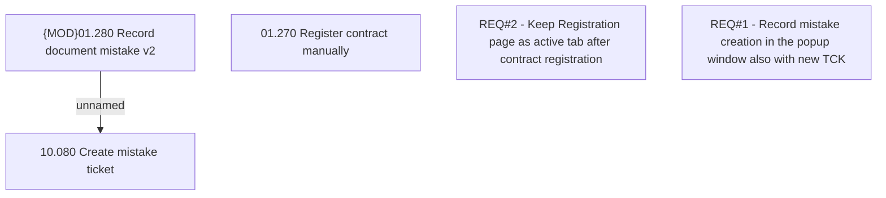

# CBL-7809 (CLM-2439) Registration mistake enhancement

- **Diagram Type**: Custom
- **Package**: HomerSelect/BSL/Requirements Model/Finished/CLM/CBL-7809 (CLM-2439) Registration mistake enhancement
- **Diagram ID**: 121561
- **Elements**: 5
- **Connectors**: 1

