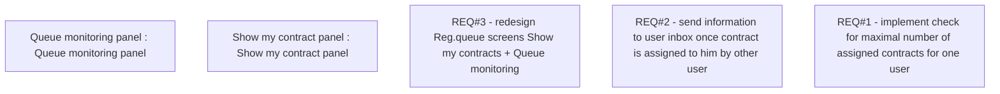

# CBL-7810 (CLM-2989) Registration Queue - Enhancement V2

- **Diagram Type**: Custom
- **Package**: HomerSelect/BSL/Requirements Model/Finished/CLM/CBL-7810 (CLM-2989) Registration Queue - Enhancement V2
- **Diagram ID**: 144778
- **Elements**: 5
- **Connectors**: 0

