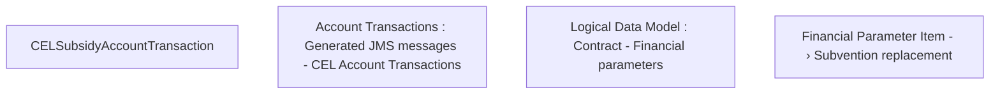

# CBL-7812 (CLM-2440) Get data about externally calculated subventions

- **Diagram Type**: Custom
- **Package**: HomerSelect/BSL/Requirements Model/Finished/CLM/CBL-7812 (CLM-2440) Get data about externally calculated subventions
- **Diagram ID**: 120846
- **Elements**: 4
- **Connectors**: 0

