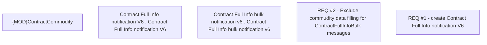

# CBL-7957 (CLM-2467) Update ContractFullInfo message with Financing Schema

- **Diagram Type**: Custom
- **Package**: HomerSelect/BSL/Requirements Model/Finished/CLM/CBL-7957 (CLM-2467) Update ContractFullInfo message with Financing Schema
- **Diagram ID**: 124247
- **Elements**: 5
- **Connectors**: 0

