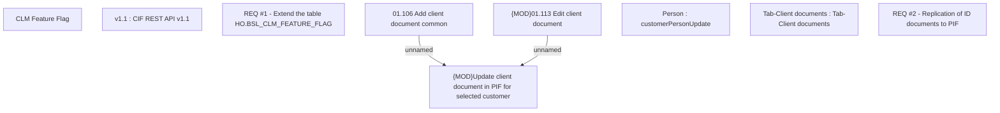

# CBL-8016 (CLM-2483) Replication of ID documents to PIF

```mermaid
graph TD
    CLM_Feature_Flag["CLM Feature Flag"]
    v1_1_CIF_REST_API_v1_1["v1.1 : CIF REST API v1.1"]
    REQ_1_Extend_the_table_HO_BSL_CLM_FEATURE_FLAG["REQ #1 - Extend the table HO.BSL_CLM_FEATURE_FLAG"]
    MOD_01_113_Edit_client_document["{MOD}01.113 Edit client document"]
    n_01_106_Add_client_document_common["01.106 Add client document common"]
    MOD_Update_client_document_in_PIF_for_selected_customer["{MOD}Update client document in PIF for selected customer"]
    Person_customerPersonUpdate["Person : customerPersonUpdate"]
    Tab_Client_documents_Tab_Client_documents["Tab-Client documents : Tab-Client documents"]
    REQ_2_Replication_of_ID_documents_to_PIF["REQ #2 - Replication of ID documents to PIF"]
    n_01_106_Add_client_document_common -->|unnamed| MOD_Update_client_document_in_PIF_for_selected_customer
    MOD_01_113_Edit_client_document -->|unnamed| MOD_Update_client_document_in_PIF_for_selected_customer
```
