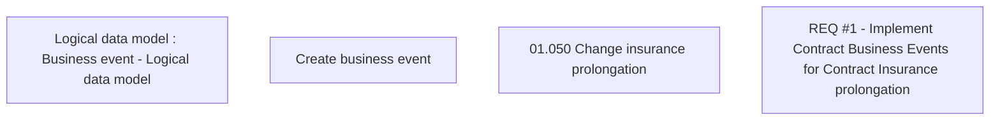

# CBL-8020 (CLM-2520) Enrollment of Insurance prolongation switch on into Contract Business Events

- **Diagram Type**: Custom
- **Package**: HomerSelect/BSL/Requirements Model/Finished/CLM/CBL-8020 (CLM-2520) Enrollment of Insurance prolongation switch on into Contract Business Events
- **Diagram ID**: 120956
- **Elements**: 4
- **Connectors**: 0

