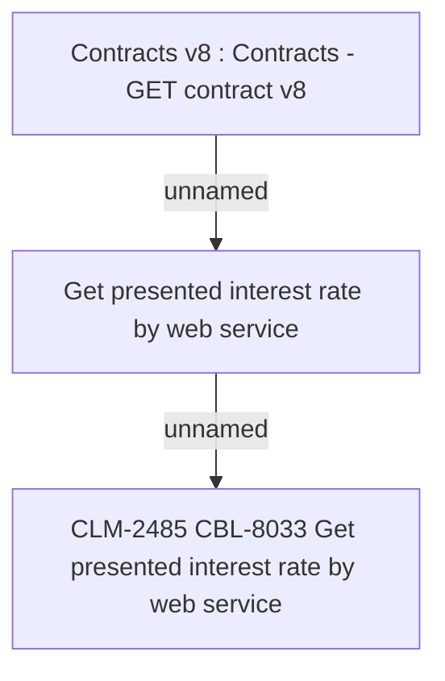

# CBL-8033 (CLM-2485) Get presented interest rate by web service

- **Diagram Type**: Custom
- **Package**: HomerSelect/BSL/Requirements Model/Finished/CLM/CBL-8033 (CLM-2485) Get presented interest rate by web service
- **Diagram ID**: 121398
- **Elements**: 3
- **Connectors**: 2

