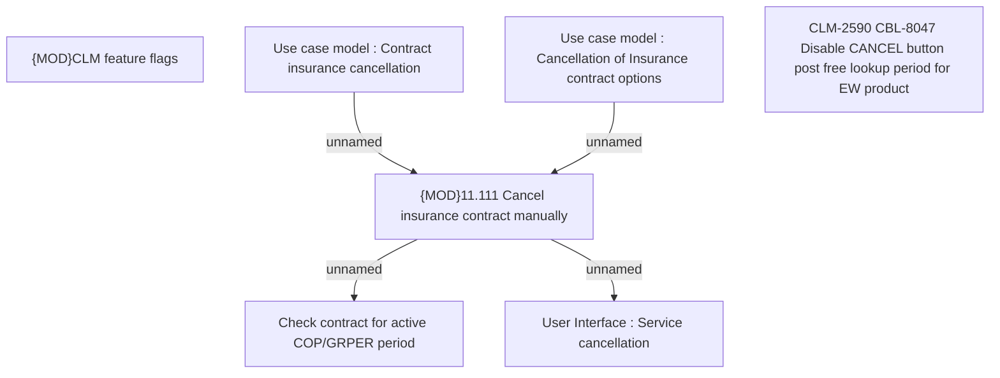

# CBL-8047 (CLM-2590) Disable CANCEL button post free lookup period for EW product

- **Diagram Type**: Custom
- **Package**: HomerSelect/BSL/Requirements Model/Finished/CLM/CBL-8047 (CLM-2590) Disable CANCEL button post free lookup period for EW product
- **Diagram ID**: 125979
- **Elements**: 7
- **Connectors**: 4

