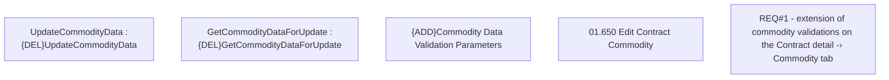

# CBL-8118 (CLM-2620) Change Model as Mandatory Field in BSL

```mermaid
graph TD
    UpdateCommodityData_DEL_UpdateCommodityData["UpdateCommodityData :{DEL}UpdateCommodityData"]
    GetCommodityDataForUpdate_DEL_GetCommodityDataForUpdate["GetCommodityDataForUpdate :{DEL}GetCommodityDataForUpdate"]
    ADD_Commodity_Data_Validation_Parameters["{ADD}Commodity Data Validation Parameters"]
    n_01_650_Edit_Contract_Commodity["01.650 Edit Contract Commodity"]
    REQ_1_extension_of_commodity_validations_on_the_Contract_det["REQ#1 - extension of commodity validations on the Contract detail -› Commodity tab"]
```
