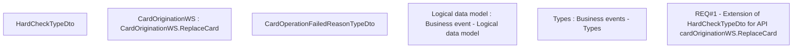

# CBL-8142 (CLM-2613) Adding checks for Card reissue

- **Diagram Type**: Custom
- **Package**: HomerSelect/BSL/Requirements Model/Finished/CLM/CBL-8142 (CLM-2613) Adding checks for Card reissue
- **Diagram ID**: 125980
- **Elements**: 6
- **Connectors**: 0

