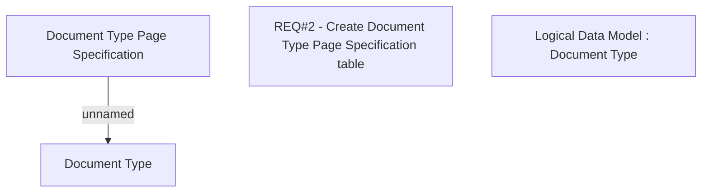

# CBL-8156 (CSI-155) Integration with Inovatrics - extension of document type definition (step2)

- **Diagram Type**: Custom
- **Package**: HomerSelect/BSL/Requirements Model/Finished/CLM/CBL-8156 (CLM-2783) Integration with Inovatrics
- **Diagram ID**: 144815
- **Elements**: 4
- **Connectors**: 1

