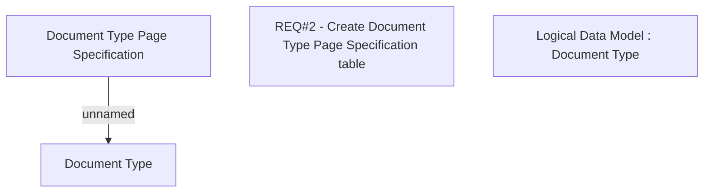

# CBL-8156 (CSI-155) Integration with Inovatrics - extension of document type definition (step2)

```mermaid
graph TD
    Document_Type["Document Type"]
    Document_Type_Page_Specification["Document Type Page Specification"]
    REQ_2_Create_Document_Type_Page_Specification_table["REQ#2 - Create Document Type Page Specification table"]
    Logical_Data_Model_Document_Type["Logical Data Model : Document Type"]
    Document_Type_Page_Specification -->|unnamed| Document_Type
```
